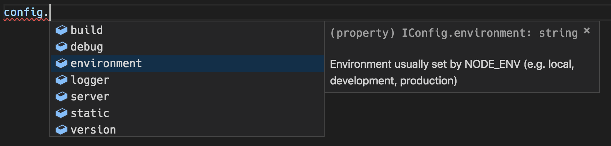

# @hellroot/config

[](https://www.npmjs.com/package/@hellroot/config)
[](https://david-dm.org/hellroot/config)
[](https://david-dm.org/hellroot/config?type=dev)
[](https://github.com/prettier/prettier)

NodeJS application configuration library. It loads your configs as NodeJS modules, not JSONs.

## Quick Start

Install package:

```bash
npm install @hellroot/config
```

Create `config` directory:

```
project/
  config/
    default.js
    local.js
    development.js
    testing.js
    production.js
```

Import library and use resulting object defined in default export:

```javascript
import config from '@hellroot/config';

console.log(config);
```

Define `NODE_ENV` and run script:

```javascript
NODE_ENV=development node index.js
```

`config` object will include settings from `config/default.js`, `config/development.js` and `config/local.js`.
If there is a conflict of keys, the objects will be expanded, arrays and primitives will be overridden.

## Example

`default.js`

```javascript
const config = {
  logger: {
    level: 'info'
  },

  server: {
    port: 80,
    ips: ['127.0.0.1']
  }
};

module.exports = config;
```

`development.js`

```javascript
const config = {
  backend: {
    baseUrl: 'https://dev-api.weather.yandex.ru/v1/'
  },

  static: {
    baseUrl: '/static'
  }
};

module.exports = config;
```

`local.js`

```javascript
const config = {
  backend: {
    baseUrl: 'http://127.0.0.1:8090/v1/'
  },

  server: {
    port: 8080,
    ips: ['127.0.0.1', '192.168.1.69']
  }
};

module.exports = config;
```

Resulting object:

```javascript
const config = {
  backend: {
    baseUrl: 'http://127.0.0.1:8090/v1/'
  },

  logger: {
    level: 'info'
  },

  server: {
    port: 8080,
    ips: ['127.0.0.1', '192.168.1.69']
  },

  static: {
    baseUrl: '/static'
  }
};
```

## TypeScript integration

You can use this module in TypeScript projects without pain. See `example` directory.



One caveat: you will have to describe your configuration manually.
